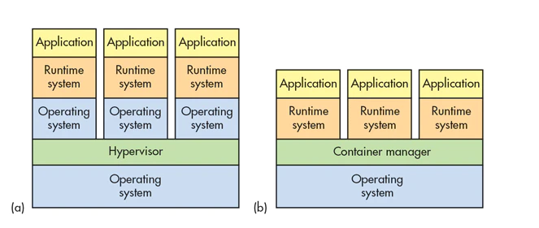
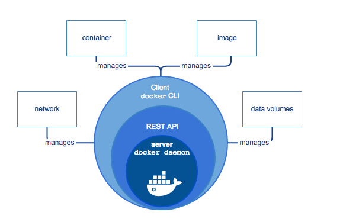

# Dockerize your life

<!-- vim-markdown-toc GFM -->

* [What is docker?](#what-is-docker)
  * [Difference between VM and Container](#difference-between-vm-and-container)
  * [Docker architecture.](#docker-architecture)
  * [Docker live cycle](#docker-live-cycle)
  * [Empathy](#empathy)
  * [Cmds](#cmds)
* [Check installation](#check-installation)
  * [Docker build](#docker-build)
    * [Docker file](#docker-file)
      * [Build](#build)
  * [Docker images](#docker-images)
  * [Docker run](#docker-run)
    * [Expose port](#expose-port)
  * [Docker ps](#docker-ps)
  * [Docker inspect](#docker-inspect)
  * [Docker tag](#docker-tag)
  * [Docker login](#docker-login)
  * [Docker push](#docker-push)
  * [Docker pull](#docker-pull)
  * [Other images](#other-images)
  * [Docker volume](#docker-volume)
  * [Docker exec](#docker-exec)
* [Do it yourself](#do-it-yourself)
  * [Extra: Docker pipelines](#extra-docker-pipelines)
* [Para los putos amos !!!](#para-los-putos-amos-)

<!-- vim-markdown-toc -->
## What is Docker?

- Open source project
- allows a easy way to **package**, **run** and **share** your app in a isolated environment (container)

### Difference between VM and Container



### Benefits
 
  - Flexible: Even the most complex applications can be containerized.
  - Lightweight: Containers leverage and share the host kernel, making them much more efficient in terms of system resources than virtual machines.
  - Portable: You can build locally, deploy to the cloud, and run anywhere.
  - Loosely coupled: Containers are highly self sufficient and encapsulated, allowing you to replace or upgrade one without disrupting others.
  - Scalable: You can increase and automatically distribute container replicas across a datacenter.
  - Secure: Containers apply aggressive constraints and isolations to processes without any configuration required on the part of the user.

### Docker architecture



### Docker life cycle
<Mermaid chart={`
	stateDiagram
    Devs --> Registry: push app
    Devs --> Server: run app
    Registry --> Server: pull app
    state Devs {
        docker_build --> docker_push
    }
    state Registry {
      docker_images
    }
    state Server {
        docker_pull --> docker_run
    }
`}/>

### Empathy life cycle

<Mermaid chart={`
	stateDiagram
    Dev --> Git
    Git --> Jenkins
    Jenkins --> Registry: push app
    Jenkins --> ServerProd: run app
    Registry --> ServerProd: pull app
    state Dev {
        git_commit --> git_push
    }
    state Jenkins {
        git_pull --> docker_build
        docker_build --> docker_push
    }
    state Registry {
        docker_image
    }
    state ServerProd { 
        docker_pull --> docker_run
    }
`}/>

## First steps

1. Check you have installed Docker:

```bash 
docker --version
```

*You should see something like:*

```bash
Docker version 19.03.8, build afacb8b
```

2. Check that you can run a container:

```bash 
docker run hello-world
```

*You should see something like:*

```bash
Unable to find image 'hello-world:latest' locally
latest: Pulling from library/hello-world
1b930d010525: Pull complete
Digest: sha256:f9dfddf63636d84ef479d645ab5885156ae030f611a56f3a7ac7f2fdd86d7e4e
Status: Downloaded newer image for hello-world:latest

Hello from Docker!
This message shows that your installation appears to be working correctly.

To generate this message, Docker took the following steps:
 1. The Docker client contacted the Docker daemon.
 2. The Docker daemon pulled the "hello-world" image from the Docker Hub.
    (amd64)
 3. The Docker daemon created a new container from that image which runs the
    executable that produces the output you are currently reading.
 4. The Docker daemon streamed that output to the Docker client, which sent it
    to your terminal.

To try something more ambitious, you can run an Ubuntu container with:
 $ docker run -it ubuntu bash

Share images, automate workflows, and more with a free Docker ID:
 https://hub.docker.com/

For more examples and ideas, visit:
 https://docs.docker.com/get-started/
```

## Docker build

1. Clone [this repository](https://github.com/empathyco/dockerizeyourlife) running: 

```bash
git clone https://github.com/empathyco/dockerizeyourlife.git
```

2. Go to the folder:

```bash
cd dockerizeyourlife
```

3. Check the Dockerfile in the root folder:

```makefile
# You can extend an existing image
FROM ubuntu
# Add metadata
LABEL "com.empathy.talk"="Dockerize you live"
LABEL maintainer="cesarg@empathy.co"
# Expose ports
EXPOSE 3000
# Set the user
USER root
# Set build arguments
ARG EMAIL
ARG COMPANY=empathy
# It is possible to run cmd
RUN apt update && apt install -y vim
RUN mkdir /app /myvol
# You can set enviromentals vars
ENV COMPANY "empathy"
# You can copy files
ADD app /app
COPY README.md /app/
RUN sed -i 's/EMAIL/'${EMAIL}'/' /app/vim.md
# Add a volume
VOLUME /myvol
# You can set the working directory
WORKDIR /app
# Set a healthcheck
HEALTHCHECK --interval=5m --timeout=3s \
  CMD cat /app/vim.md || exit 1
# Set a init cmd
#CMD ["vim", "/app/vim.md"]
ENTRYPOINT ["vim", "/app/vim.md"]
```

4. Run the build: 

```bash
docker build --build-arg EMAIL="yourname" -t test-empathy -f Dockerfile .
```

5. *You should see something like:*

```bash
# Build start  
Sending build context to Docker daemon  416.3kB
# We download the parent image
Step 1/16 : FROM ubuntu
 ---> 72300a873c2c
# For each line of the Dockerfile docker creates a new layer
Step 2/16 : LABEL "com.empathy.talk"="Dockerize your life"
 ---> Using cache
 ---> 7b89f8b0e00f
 # This layer a cached, next time we build the image the layer will be not rebuild
 # this reduce the build time
Step 3/16 : LABEL maintainer="cesarg@empathy.co"
 ---> Using cache
 ---> 07523f71102e
 # If you modify the step/line in the Dockerfile all next steps will be rebuild.
 # This also happen if you copy a file as you create a new layer
Step 4/16 : EXPOSE 3000
 ---> Using cache
 ---> 3ad6fad071cf
Step 5/16 : USER root
 ---> Using cache
 ---> b80a693c5e18
Step 6/16 : ARG EMAIL
 ---> Using cache
 ---> 2632e3fe7fa9
Step 7/16 : ARG COMPANY=empathy
 ---> Using cache
 ---> e9b4c8100f7f
Step 8/16 : RUN apt update && apt install -y vim
 ---> Using cache
 ---> a4703eb24b67
Step 9/16 : RUN mkdir /app /myvol
 ---> Using cache
 ---> 4733de4d2bea
Step 10/16 : ENV MY_VAR "empathy"
 ---> Using cache
 ---> 42d517fb07df
Step 11/16 : ADD app /app
 ---> Using cache
 ---> 7bafd5fe61b6
Step 12/16 : COPY README.md /app/
 ---> 28df5342e515
Step 13/16 : RUN sed -i 's/EMAIL/'${EMAIL}'/' /app/vim.md
 ---> Running in 59844c6bb6d9
Removing intermediate container 59844c6bb6d9
 ---> ff4b84ffa6eb
Step 14/16 : WORKDIR /app
 ---> Running in 45a37a114dc4
Removing intermediate container 45a37a114dc4
 ---> 8babcd3c14c9
Step 15/16 : HEALTHCHECK --interval=5m --timeout=3s   CMD cat /app/vim.md || exit 1
 ---> Running in e8ca831f36f3
Removing intermediate container e8ca831f36f3
 ---> e177696340fb
Step 16/16 : ENTRYPOINT ["vim", "/app/vim.md"]
 ---> Running in 2394eaf74011
Removing intermediate container 2394eaf74011
 ---> b0e7ea6c9093
Successfully built b0e7ea6c9093
Successfully tagged test-empathy:latest
....
```

## Docker images

1. Lets see the image created:

```bash
docker images | grep test-empathy
```

*You should see something like:*

```bash
REPOSITORY        TAG                    IMAGE ID            CREATED             SIZE
test-empathy      latest                 ac37b42d6e11        25 minutes ago      153MB
```

2. We can delete also the image. Check what `rmi` command does:

```bash
docker rmi --help
```

*You should see something like:*

```bash
Usage:	docker rmi [OPTIONS] IMAGE [IMAGE...]

Remove one or more images

Options:
  -f, --force      Force removal of the image
      --no-prune   Do not delete untagged parents
```

3. Lets delete our image:

```bash
docker rmi test-empathy -f
```

*You should see something like:*
```bash
Untagged: test-empathy:latest
# It delete each of the layer that we have created in the Dockerfile
Deleted: sha256:b0e7ea6c909307294c26d736e943a143e422b945c7a712366d99e03c54d14c83
# It is important to group proper the instructions/layer to avoid rebuilding
# layers that we can cache
Deleted: sha256:e177696340fb75a73f048f5bc113fcb21b268b1ca26d67eb5efed19287421582
Deleted: sha256:8babcd3c14c9a927540d04ec02b5a473a8fac60a4ee35392ce95a528eb0be52a
Deleted: sha256:ff4b84ffa6ebd221c557bdba9b1ff90afc6999264f64fa57f27b2a63ee998432
Deleted: sha256:60a8eced2e81794b24f050a729d93a969803a4fb3f6bc15b130603c613cc8194
Deleted: sha256:28df5342e515b7c8187b58fee4cc0d44609ddbd3cef3a27aad455c633d2fa8f1
Deleted: sha256:0c5f88939e979d87ac57689e48de4f4be21daa1c60e1888707a6dfce5c45164d
```

## Docker run

1. Create again the image:

```bash
docker build --build-arg EMAIL="yourname" -t test-empathy -f Dockerfile .
```

2. Run the image by creating a container:

```bash
docker run -e COMPANY=empathy -t test-empathy
```

3. Open a new terminal and run:

```bash
docker ps
```

*You should see something like:*

```bash
CONTAINER ID        IMAGE               COMMAND             CREATED             STATUS                             PORTS               NAMES
cffa30d1473c        test-empathy        "vim /app/vim.md"   16 seconds ago      Up 16 seconds (health: starting)   3000/tcp            loving_mclean
```

4. Stop the container changing the **CONTAINER_ID** tag with the one shown before:

```bash
docker stop <CONTAINER_ID>
```

5. We can delete the container changing the **CONTAINER_ID** tag with the one shown before:

```bash
docker rm <CONTAINER_ID>
```

## Expose port

1. Go to **golang-app** path:

```bash
cd golang-app
```

2. Check the Dockerfile:

```makefile
FROM golang:1.7.3
WORKDIR /go/src/github.com/empathy/dockerize/
COPY main.go .
RUN go get -d -v golang.org/x/net/html \
  && CGO_ENABLED=0 GOOS=linux go build -a -installsuffix cgo -o app .
CMD ["/go/src/github.com/empathy/dockerize/app"]
```

3. Build the image:

```bash
docker build -t empathy-example-golang .
```

4. Set the ports we want to use:

```bash
export PORT_INTERNAL=5000 # Use our app
export PORT_EXTERNAL=5001 # Use our host (your machine)
```

5. Run the container forwarding the port:

  - **-it**: Run tty mode.
  - **--name**: Container name.
  - **-e**: Set env var for the port in our app.
  - **-p**: Set port to forward in host.
```bash
docker run -it --name golang-app -e PORT="${PORT_INTERNAL}" -p "${PORT_EXTERNAL}:${PORT_INTERNAL}" empathy-example-golang
```

6. Test the running app in a new terminal window:

```bash
curl localhost:9000/hola_que_ase
```

*You should see something like:* 

```bash
curl: (7) Failed to connect to localhost port 9000: Connection refused
```

7. Try again:

```bash
curl localhost:5001/hola_que_ase
```

Now *You should see something like:* 

```bash
Hello from Empathy Golang service hola_que_ase!
```

## Docker ps

1. We can check running container by doing:

```bash
docker ps
```

*You should see something like:*

```bash
CONTAINER ID        IMAGE                    COMMAND                  CREATED             STATUS              PORTS                    NAMES
03879f54c875        empathy-example-golang   "/go/src/github.com/…"   4 minutes ago       Up 4 minutes        0.0.0.0:5001->5000/tcp   golang-app
```

2. We can stop/start the container:

```bash
docker stop golang-app
```

3. Check again:

```bash
docker ps
```

Nothing should appear under the header.

4. But... Check all of them:

```bash
docker ps -a | grep golang-app
```

*You should see something like:*

```bash
CONTAINER ID        IMAGE                    COMMAND                  CREATED             STATUS              PORTS                    NAMES
aaa9c1e1f618        empathy-example-golang   "/go/src/github.com/…"   50 seconds ago       Exited (0) 2 seconds ago                     golang-app
```

5. Start it again:

```bash 
docker start golang-app
```

6. Check containers again:
```bash
docker ps
```

*You should see something like:*

```bash
CONTAINER ID        IMAGE                    COMMAND                  CREATED             STATUS              PORTS                    NAMES
aaa9c1e1f618        empathy-example-golang   "/go/src/github.com/…"   2 seconds ago       Up 1 second         0.0.0.0:5000->9000/tcp   golang-app
```

7. Stop again to free the port:

```bash
docker stop golang-app
```

## Docker inspect

Show more info about the container:

```bash
docker inspect golang-app
```

## Docker tag

1. Change the name of the image:

```bash
export OLD_IMAGE_NAME="empathy-example-golang"
export NEW_IMAGE_NAME="empathyco/golang"
export BASE64_EMAIL=`echo "youremail@empathy.co" | base64`
export DOCKER_TAG=`echo "${BASE64_EMAIL//=}"`
docker tag "${OLD_IMAGE_NAME}" "${NEW_IMAGE_NAME}:${DOCKER_TAG}"
```

2. Inspect the images:

```bash
docker images
```

*You should see something like:*

```bash
REPOSITORY               TAG                            IMAGE ID            CREATED             SIZE
empathy-example-golang   latest                         ef40c2534f4a        38 minutes ago      697MB
empathyco/golang         eW91cmVtYWlsQGVtcGF0aHkuY28K   ef40c2534f4a        38 minutes ago      697MB
```

## Docker login

Login in a remote registry to share our images and download others. You can login in multiple registry.

1. Check the command:

```bash
docker login --help
```

*You should see something like:*

```bash
Usage:	docker login [OPTIONS] [SERVER]

Log in to a Docker registry.
If no server is specified, the default is defined by the daemon.

Options:
  -p, --password string   Password
      --password-stdin    Take the password from stdin
  -u, --username string   Username
```

2. Login into hub.docker.com:

```bash
docker login
```

*You should see something like:*

```bash
Authenticating with existing credentials...
Login Succeeded
```

## Docker push

We can push our images to share it.

1. Set variables:

```bash
# This is the name of the repository
# Format: ${REPOSITORY_URL}/${IMAGE_NAME}:${TAG}
# the default tag is latest
# the default registry is docker.io
# example: eu.gcr.io/empathy/golang:master
export IMAGE_NAME="empathyco/golang"
export BASE64_EMAIL=`echo "youremail@empathy.co" | base64`
export TAG=`echo "${BASE64_EMAIL//=}"`
```

2. Push the image:

```bash
docker push "${IMAGE_NAME}:${TAG}"
```

:::info
Time to take a ☕️ meanwhile `docker push` ends.
:::

## Docker pull

1. Now, we can share our image, ask for the email of one of your colleagues and hash it:

```bash
export BASE64_EMAIL=`echo "youcolleagueemail@empathy.co" | base64`
export COLLEAGUE_EMAIL_HASH=`echo "${BASE64_EMAIL//=}"`
export IMAGE_NAME=empathy/golang
```

2. Download the new image

```bash
docker pull "${IMAGE_NAME}:${COLLEAGUE_EMAIL_HASH}"
```

3. Run it:

```bash
docker run "${IMAGE_NAME}:${COLLEAGUE_EMAIL_HASH}"
```

## Other images

1. As you could see in [hub.docker.com](hub.docker.com) there are tones of other apps. Lets run a mongo (https://hub.docker.com/_/mongo):

```bash
docker pull mongo 
```

*You should see something like:*

```bash
Using default tag: latest
latest: Pulling from library/mongo
5bed26d33875: Already exists
f11b29a9c730: Already exists
930bda195c84: Already exists
78bf9a5ad49e: Already exists
3d7fb3809884: Already exists
a7237292ff8a: Already exists
c936e28b5159: Already exists
3fb56b127f30: Already exists
c54a0478af29: Already exists
ffc3a4dd1cdc: Already exists
236ffdb10499: Already exists
c33efe03b109: Already exists
1d3609ce2ac9: Already exists
Digest: sha256:1e33093260855e83baee0237e29947e243818c58a1d37b1022909e227f624d7a
Status: Downloaded newer image for mongo:latest
docker.io/library/mongo:latest
```

2. You can also download a specific version by changing the tag:

```bash
docker pull mongo:3.6.17
```

3. Lets run it:
  - **-d**: Detach mode to run in the background.
  - **--name**: Container name.
  - **--rm**: Remove the container after termination.

```
docker run --rm --name mongodb -d -p 9000:27017 mongo
```

3. Check mongo is running:

```bash
docker ps
```

*You should see something like:*

```bash
CONTAINER ID        IMAGE               COMMAND                  CREATED             STATUS              PORTS                      NAMES
f55ff4c5015a        mongo               "docker-entrypoint.s…"   22 minutes ago      Up 1 second         0.0.0.0:27017->27017/tcp   mongodb
```

4. Now we can connect to localhost:

```bash
mongo mongodb://localhost:9000
```

:::caution
You will need a **mongodb CLI** to connect.
:::

*You should see something like:*

```bash
MongoDB shell version v4.2.0
connecting to: mongodb://127.0.0.1:27017/?compressors=disabled&gssapiServiceName=mongodb
Implicit session: session { "id" : UUID("225866a8-767a-4648-8798-95043701e5e6") }
MongoDB server version: 4.2.5
Server has startup warnings:
2020-04-15T11:01:35.611+0000 I  STORAGE  [initandlisten]
2020-04-15T11:01:35.611+0000 I  STORAGE  [initandlisten] ** WARNING: Using the XFS filesystem is strongly recommended with the WiredTiger storage engine
2020-04-15T11:01:35.611+0000 I  STORAGE  [initandlisten] **          See http://dochub.mongodb.org/core/prodnotes-filesystem
2020-04-15T11:01:36.392+0000 I  CONTROL  [initandlisten]
2020-04-15T11:01:36.392+0000 I  CONTROL  [initandlisten] ** WARNING: Access control is not enabled for the database.
2020-04-15T11:01:36.392+0000 I  CONTROL  [initandlisten] **          Read and write access to data and configuration is unrestricted.
2020-04-15T11:01:36.392+0000 I  CONTROL  [initandlisten]
---
Enable MongoDBs free cloud-based monitoring service, which will then receive and display
metrics about your deployment (disk utilization, CPU, operation statistics, etc).

The monitoring data will be available on a MongoDB website with a unique URL accessible to you
and anyone you share the URL with. MongoDB may use this information to make product
improvements and to suggest MongoDB products and deployment options to you.

To enable free monitoring, run the following command: db.enableFreeMonitoring()
To permanently disable this reminder, run the following command: db.disableFreeMonitoring()
---
```

5. Run inside mongodb terminal to show databases:

```bash
show dbs
```

*You should see something like:*

```bash
admin   0.000GB
config  0.000GB
local   0.000GB
```

6. Exit from mongo:

```bash
exit
```

7. Stop container for now:

```bash
docker stop mongodb
```

## Docker volume

1. When we delete a container all data that is stored is deleted also. For that we have docker volume:

```bash
docker volume create mongodbdata
```

2. List the volume:

```bash
docker volume ls
```

You should see somthing like:

```bash
DRIVER              VOLUME NAME
local               mongodbdata
```

3. Inspect the volume:

```bash
docker volume inspect mongodbdata
```

*You should see something like:*

```bash
[
    {
        "CreatedAt": "2020-04-15T11:15:14Z",
        "Driver": "local",
        "Labels": {},
        "Mountpoint": "/var/lib/docker/volumes/mongodbdata/_data",
        "Name": "mongodbdata",
        "Options": {},
        "Scope": "local"
    }
]
```

4. Delete it:

```bash
docker volume rm mongodbdata
```

5. And create it again!

```bash
docker volume create mongodbdata
```

6. Run the container:

```bash
docker run --name mongodb -v mongodbdata:/data/db -p 9000:27017 mongo
```

7. Connect to mongo in other terminal window:

```bash
mongo mongodb://localhost:9000
```

8. Lets insert some data:

```bash
db.tutorial.insert({"name":"dockerize"});
db.tutorial.findOne();
```

*You should see something like:*

```bash
{ "_id" : ObjectId("5e96efcbd9af284a9809ac0a"), "name" : "dockerize" }
```

9. Exit from mongo:

```bash
exit
```

10. Delete the container:

```bash
docker stop mongodb && docker rm mongodb
```

11. Now lets run it again:

```bash
docker run --name mongodb -v mongodbdata:/data/db -p 9000:27017 -d mongo
```

12. Connect to mongo:

```bash
mongo mongodb://localhost:9000
```

13. Check that the data is still there:

```bash
db.tutorial.findOne();
```

*You should see something like:*

```bash
{ "_id" : ObjectId("5e96efcbd9af284a9809ac0a"), "name" : "dockerize" }
```

:::tip
You can also create anonymous volume by doing:
```bash
mkdir data
export PATH_TO_YOUR_FOLDER="${PWD}/data"
docker run --name mongodb -v ${PATH_TO_YOUR_FOLDER}:/data/db -p 9000:27017 mongo
```
:::

## Docker exec 

You can run cmd also in the container:

  - **-it**: tty activated, so keyboard can be use.
  - **mongodb**: Container name.
  - **/bin/bash**: CMD you want to run.

```bash
docker exec -it mongodb /bin/bash root@f55ff4c5015a:/ 
```

## Do it yourself

Now that we know the basic of docker (networking is missing but it will be cover in future talk), let see what you got.

Navigate to `node-app`, there you will see an small aplication in nodejs. This app is a **webserver** that is **exposed** in the port set in the env var **APP_PORT**. 

:::info
For this exercise you will need **node.js** and **jq**.

- Install node.js
```bash
brew install node
```

- Install jq
```bash
brew install jq
```
:::

1. Navigate to path:

```bash
cd ../node-app
```

2. Install dependencies:

```bash
npm install
```

3. Run the app:

```bash
export APP_PORT=5000
export EMAIL="adasfef" 
node app.js
```

*You should see something like:*

```bash
Example app listening at http://localhost:5000
```

The webapp has an endpoint configured to run the following script:

```bash
#!/bin/bash
set -xeu
VERSION=$(cat package.json | jq '.version')
MESSAGE_PATH=Message.txt
sed -i 's/VERSION/'${VERSION}'/' /opt/Message.txt
sed -i 's/EMAIL/'${1}'/g' /opt/Message.txt
cat /opt/Message.txt
```

3. Call the app just running:

```bash
export APP_PORT=5000
curl "localhost:${APP_PORT}"
```

*You should see something like:*

```bash
Casi lo tienes, crack!!!
```

4. Create a Dockerfile and run the app: 

```bash
docker run ...
```

5. Call the app again:

```bash
export APP_PORT=5000
curl "localhost:${APP_PORT}"
```

*You should see something like  (🌈):*

```bash
Well little papaya!!!
Version: "1.0.0"
Email: youemail
Eres un Hackermaaaaan !!!
```

## Extra: Docker pipelines

1. Check the following **Dockerfile.pipeline**: 

```makefile
# Use a tar image to compress the repo
FROM ubuntu AS tar
COPY . /app/
RUN mkdir /static
RUN cd /app/ &&\
       tar -cvzf empathy-template.tar.gz * && \
        mv /app/empathy-template.tar.gz /static
# Use pandoc image to build an index.html
FROM pandoc/core AS pandoc
COPY README.md /app/README.md
COPY pandoc.css /app/pandoc.css
RUN pandoc -f markdown /app/README.md --css /app/pandoc.css -o /app/index.html --self-contained --metadata title="Dockerize"
# Copy tar and index and serve it in a nginx image
FROM bitnami/nginx:1.16.1-debian-10-r46
COPY --from=tar /static/empathy-template.tar.gz /app/empathy-template.tar.gz
COPY --from=pandoc /app/index.html /app/index.html
```

2. Go to root path:

```bash
cd ..
```

3. Build the image:

```bash
docker build -t empathyco/pipeline -f Dockerfile.pipeline .
```

4. Run the image:

```bash
docker run -p 8080:8080 -it empathyco/pipeline
```

3. Go to http://localhost:8080.

## Para los putos amos!!!

Choose any language and create a Dockerfile that do the following:

1. Clone a repo.

2. Detect if has a Dockerfile.

3. Build the app.

4. Push the app to empathy/[name of the repo].

5. Create a html report of the email with the build status.

6. The end images should be minimun.

