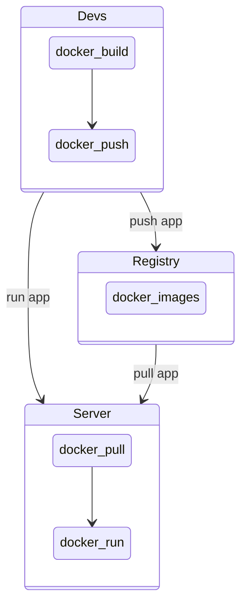
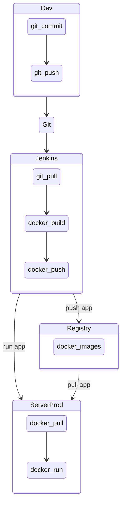

# Dockerize your live

<!-- vim-markdown-toc GFM -->

* [What is docker?](#what-is-docker)
  * [Difference between VM and Container](#difference-between-vm-and-container)
  * [Docker architecture.](#docker-architecture)
  * [Docker live cycle](#docker-live-cycle)
  * [Empathy](#empathy)
  * [Cmds](#cmds)
* [Check installation](#check-installation)
  * [Docker build](#docker-build)
    * [Docker file](#docker-file)
      * [Build](#build)
  * [Docker images](#docker-images)
  * [Docker run](#docker-run)
    * [Expose port](#expose-port)
  * [Docker ps](#docker-ps)
  * [Docker inspect](#docker-inspect)
  * [Docker tag](#docker-tag)
  * [Docker login](#docker-login)
  * [Docker push](#docker-push)
  * [Docker pull](#docker-pull)
  * [Other images](#other-images)
  * [Docker volume](#docker-volume)
  * [Docker exec](#docker-exec)
* [Do it yourself](#do-it-yourself)
  * [Extra: Docker pipelines](#extra-docker-pipelines)
* [Para los putos amos !!!](#para-los-putos-amos-)

<!-- vim-markdown-toc -->
## What is docker?

- Open source project
- allows a easy way to **package**, **run** and **share** your app in a isolated environment (container)

### Difference between VM and Container


- Benefits: 
  - Flexible: Even the most complex applications can be containerized.
  - Lightweight: Containers leverage and share the host kernel, making them much more efficient in terms of system resources than virtual machines.
  - Portable: You can build locally, deploy to the cloud, and run anywhere.
  - Loosely coupled: Containers are highly self sufficient and encapsulated, allowing you to replace or upgrade one without disrupting others.
  - Scalable: You can increase and automatically distribute container replicas across a datacenter.
  - Secure: Containers apply aggressive constraints and isolations to processes without any configuration required on the part of the user.

### Docker architecture.


### Docker live cycle



### Empathy




### Cmds

## Check installation

```sh 
# Check docker version
docker --version
Docker version 19.03.8, build afacb8b
# Check that you can run a container
docker run hello-word
Unable to find image 'hello-world:latest' locally
latest: Pulling from library/hello-world
1b930d010525: Pull complete
Digest: sha256:f9dfddf63636d84ef479d645ab5885156ae030f611a56f3a7ac7f2fdd86d7e4e
Status: Downloaded newer image for hello-world:latest

Hello from Docker!
This message shows that your installation appears to be working correctly.

To generate this message, Docker took the following steps:
 1. The Docker client contacted the Docker daemon.
 2. The Docker daemon pulled the "hello-world" image from the Docker Hub.
    (amd64)
 3. The Docker daemon created a new container from that image which runs the
    executable that produces the output you are currently reading.
 4. The Docker daemon streamed that output to the Docker client, which sent it
    to your terminal.

To try something more ambitious, you can run an Ubuntu container with:
 $ docker run -it ubuntu bash

Share images, automate workflows, and more with a free Docker ID:
 https://hub.docker.com/

For more examples and ideas, visit:
 https://docs.docker.com/get-started/
```

### Docker build

#### Docker file

##### Build


```Dockerfile
# You can extend an existing image
FROM ubuntu
# Add metadata
LABEL "com.empathy.talk"="Dockerize you live"
LABEL maintainer="cesarg@empathy.co"
# Expose ports
EXPOSE 3000
# Set the user
USER root
# Set build arguments
ARG EMAIL
ARG COMPANY=empathy
# It is possible to run cmd
RUN apt update && apt install -y vim
RUN mkdir /app /myvol
# You can set enviromentals vars
ENV COMPANY "empathy"
# You can copy files
ADD app /app
COPY README.md /app/
RUN sed -i 's/EMAIL/'${EMAIL}'/' /app/vim.md
# Add a volume
VOLUME /myvol
# You can set the working directory
WORKDIR /app
# Set a healthcheck
HEALTHCHECK --interval=5m --timeout=3s \
  CMD cat /app/vim.md || exit 1
# Set a init cmd
#CMD ["vim", "/app/vim.md"]
ENTRYPOINT ["vim", "/app/vim.md"]
```
**Oneliner**
```sh
docker build --build-arg EMAIL="yourname" -t test-image -f Dockerfile
```

```sh
docker build \
  --build-arg EMAIL="cesar" \ # Set build arguments
  -t test-image \ # Image name
  -f Dockerfile  
# Build start  
Sending build context to Docker daemon  416.3kB
# We download the parent image
Step 1/16 : FROM ubuntu
 ---> 72300a873c2c
# For each line of the Dockerfile docker creates a new layer
Step 2/16 : LABEL "com.empathy.talk"="Dockerize you live"
 ---> Using cache
 ---> 7b89f8b0e00f
 # This layer a cached, next time we build the image the layer will be not rebuild
 # this reduce the build time
Step 3/16 : LABEL maintainer="cesarg@empathy.co"
 ---> Using cache
 ---> 07523f71102e
 # If you modify the step/line in the Dockerfile all next steps will be rebuild.
 # This also happen if you copy a file as you create a new layer
Step 4/16 : EXPOSE 3000
 ---> Using cache
 ---> 3ad6fad071cf
Step 5/16 : USER root
 ---> Using cache
 ---> b80a693c5e18
Step 6/16 : ARG EMAIL
 ---> Using cache
 ---> 2632e3fe7fa9
Step 7/16 : ARG COMPANY=empathy
 ---> Using cache
 ---> e9b4c8100f7f
Step 8/16 : RUN apt update && apt install -y vim
 ---> Using cache
 ---> a4703eb24b67
Step 9/16 : RUN mkdir /app /myvol
 ---> Using cache
 ---> 4733de4d2bea
Step 10/16 : ENV MY_VAR "empathy"
 ---> Using cache
 ---> 42d517fb07df
Step 11/16 : ADD app /app
 ---> Using cache
 ---> 7bafd5fe61b6
Step 12/16 : COPY README.md /app/
 ---> 28df5342e515
Step 13/16 : RUN sed -i 's/EMAIL/'${EMAIL}'/' /app/vim.md
 ---> Running in 59844c6bb6d9
Removing intermediate container 59844c6bb6d9
 ---> ff4b84ffa6eb
Step 14/16 : WORKDIR /app
 ---> Running in 45a37a114dc4
Removing intermediate container 45a37a114dc4
 ---> 8babcd3c14c9
Step 15/16 : HEALTHCHECK --interval=5m --timeout=3s   CMD cat /app/vim.md || exit 1
 ---> Running in e8ca831f36f3
Removing intermediate container e8ca831f36f3
 ---> e177696340fb
Step 16/16 : ENTRYPOINT ["vim", "/app/vim.md"]
 ---> Running in 2394eaf74011
Removing intermediate container 2394eaf74011
 ---> b0e7ea6c9093
Successfully built b0e7ea6c9093
Successfully tagged empatyco/vim:latest
....
```

### Docker images

```sh
# Lets see the image created
docker images | grep empathy
REPOSITORY        TAG                    IMAGE ID            CREATED             SIZE
empatyco/vim      latest                 ac37b42d6e11        25 minutes ago      153MB
# We can delete also the image
docker rmi --help
Usage:	docker rmi [OPTIONS] IMAGE [IMAGE...]

Remove one or more images

Options:
  -f, --force      Force removal of the image
      --no-prune   Do not delete untagged parents
# Lets delete our image
docker rmi empathy/vim
Untagged: empatyco/vim:latest
# It delete each of the layer that we have created in the Dockerfile
Deleted: sha256:b0e7ea6c909307294c26d736e943a143e422b945c7a712366d99e03c54d14c83
# It is important to group proper the instructions/layer to avoid rebuilding
# layers that we can cache
Deleted: sha256:e177696340fb75a73f048f5bc113fcb21b268b1ca26d67eb5efed19287421582
Deleted: sha256:8babcd3c14c9a927540d04ec02b5a473a8fac60a4ee35392ce95a528eb0be52a
Deleted: sha256:ff4b84ffa6ebd221c557bdba9b1ff90afc6999264f64fa57f27b2a63ee998432
Deleted: sha256:60a8eced2e81794b24f050a729d93a969803a4fb3f6bc15b130603c613cc8194
Deleted: sha256:28df5342e515b7c8187b58fee4cc0d44609ddbd3cef3a27aad455c633d2fa8f1
Deleted: sha256:0c5f88939e979d87ac57689e48de4f4be21daa1c60e1888707a6dfce5c45164d
```

### Docker run

```sh
# Know lets run the image  by creating a container
docker run -e COMPANY=empathy -t test-image
# We can delete the container
docker rm test-image
```

#### Expose port

In golang-app/

```Dockerfile
FROM golang:1.7.3
WORKDIR /go/src/github.com/empathy/dockerize/
COPY main.go .
RUN go get -d -v golang.org/x/net/html \
  && CGO_ENABLED=0 GOOS=linux go build -a -installsuffix cgo -o app .
CMD ["/go/src/github.com/empathy/dockerize/app"]
```

```sh
# Build
docker build \
  -t empathy-example-golang \ # Name of the image that we want to build
  . # Directory where the docker file is
# Set the ports we want to use
export PORT_INTERNAL=5000 #Use our app
export PORT_EXTERNAL=5001 # Use out host (your machine)
# Run the container with forwarding the port
docker run \
    --rm \ # Remove the container after termination
    --it \ # Run tty mode
    --name golang-app \ # Container name
    -e PORT="${PORT_INTERNAL}" \ # Set env var for the port in our app
    -p "${PORT_EXTERNAL}:${PORT_INTERNAL}" \ # Set port to forward in host
    empathy-example-golang # Name of the image to run
```
In one line
```sh
PORT_INTERNAL=5000; PORT_EXTERNAL=9000;docker build -t empathy-example-golang . && docker run --rm -it --name golang-app -p "${PORT_EXTERNAL}:${PORT_INTERNAL}" -e APP_PORT=${PORT_INTERNAL}  empathy-example-golang
```
```sh
curl localhost:9000/hola_que_ase
Hello from Empathy Golang service hola_que_ase!
```

### Docker ps

```sh
# We can check running container by doing
$ docker ps
CONTAINER ID        IMAGE                    COMMAND                  CREATED             STATUS              PORTS                    NAMES
aaa9c1e1f618        empathy-example-golang   "/go/src/github.com/…"   2 seconds ago       Up 1 second         0.0.0.0:5000->9000/tcp   golang-app
# We can stop/start the container 
$ docker stop golang-app
# Nothing running
$ docker ps
#But if we check all of them
$ docker ps -a | grep golang-app
CONTAINER ID        IMAGE                    COMMAND                  CREATED             STATUS              PORTS                    NAMES
aaa9c1e1f618        empathy-example-golang   "/go/src/github.com/…"   50 seconds ago       Exited (0) 2 seconds ago                     golang-app
# Start it again
$ docker start golang-app
$ docker ps
CONTAINER ID        IMAGE                    COMMAND                  CREATED             STATUS              PORTS                    NAMES
aaa9c1e1f618        empathy-example-golang   "/go/src/github.com/…"   2 seconds ago       Up 1 second         0.0.0.0:5000->9000/tcp   golang-app
# Stop again to free the port
$ docker stop goolang-app
```

### Docker inspect

```sh
# More info about the container
docker inspect golang-app
```
### Docker tag

```sh
# We can change the name of the image 
export OLD_IMAGE_NAME="golang-app"
export NEW_IMAGE_NAME="empathyco/golang"
export DOCKER_TAG=`echo "youemail@empathy.co" | base64`
docker tag "${OLD_IMAGE_NAME}" "${NEW_IMAGE_NAME}:${DOCKER_TAG}"
```

### Docker login

```sh
# This will login in a remote registry to share our images and download others
# You can login in multiple registry
docker login --help
Usage:	docker login [OPTIONS] [SERVER]

Log in to a Docker registry.
If no server is specified, the default is defined by the daemon.

Options:
  -p, --password string   Password
      --password-stdin    Take the password from stdin
  -u, --username string   Username
# This example login into hub.docker.com
docker login
```

### Docker push

```sh
# We can push our images to share it.
# This is  the name of the repository
# Format: ${REPOSITORY_URL}/${IMAGE_NAME}:${TAG}
# the default tag is latest
# the default registry is docker.io
# example: eu.gcr.io/empathy/golang:master
export IMAGE_NAME="empathyco/golang"
export TAG==`echo "youemail@empathy.co" | base64`

$ docker push "${IMAGE_NAME}:${TAG}"
```

### Docker pull

```sh
# Know we can share our image
# Ask for the email of one of your colleagues and hash it
export COLLEAGUE_EMAIL_HASH=`echo "youcolleagueemail@empathy.co" | base64`
export IMAGE_NAME=empathy/golang
# Download the new image
$ docker pull "${IMAGE_NAME}:${COLLEAGUE_EMAIL_HASH}"
# And run it
$ docker run "${IMAGE_NAME}:${COLLEAGUE_EMAIL_HASH}"
```

### Other images

```sh
# As you could see in hub.docker.com there are tones of other app
# Lets run a mongo https://hub.docker.com/_/mongo

$ docker pull mongo 
Using default tag: latest
latest: Pulling from library/mongo
5bed26d33875: Already exists
f11b29a9c730: Already exists
930bda195c84: Already exists
78bf9a5ad49e: Already exists
3d7fb3809884: Already exists
a7237292ff8a: Already exists
c936e28b5159: Already exists
3fb56b127f30: Already exists
c54a0478af29: Already exists
ffc3a4dd1cdc: Already exists
236ffdb10499: Already exists
c33efe03b109: Already exists
1d3609ce2ac9: Already exists
Digest: sha256:1e33093260855e83baee0237e29947e243818c58a1d37b1022909e227f624d7a
Status: Downloaded newer image for mongo:latest
docker.io/library/mongo:latest

# You can also donwload a specific version by changing the tag.
$ docker pull mongo:3.6.17
# Lets run it!!!
$ docker run \
  --name `#Name of the image` \
  -d `#Detach mode to run in the background` \
  -p 27017:27017 `#Port to forward`
  mongo
# We that mongo is running
$ docker ps
CONTAINER ID        IMAGE               COMMAND                  CREATED             STATUS              PORTS                      NAMES
f55ff4c5015a        mongo               "docker-entrypoint.s…"   22 minutes ago      Up 1 second         0.0.0.0:27017->27017/tcp   mongodb
# Now we can connect to localhost
# you will need a mongodb cli to connect
$ mongo
MongoDB shell version v4.2.0
connecting to: mongodb://127.0.0.1:27017/?compressors=disabled&gssapiServiceName=mongodb
Implicit session: session { "id" : UUID("225866a8-767a-4648-8798-95043701e5e6") }
MongoDB server version: 4.2.5
Server has startup warnings:
2020-04-15T11:01:35.611+0000 I  STORAGE  [initandlisten]
2020-04-15T11:01:35.611+0000 I  STORAGE  [initandlisten] ** WARNING: Using the XFS filesystem is strongly recommended with the WiredTiger storage engine
2020-04-15T11:01:35.611+0000 I  STORAGE  [initandlisten] **          See http://dochub.mongodb.org/core/prodnotes-filesystem
2020-04-15T11:01:36.392+0000 I  CONTROL  [initandlisten]
2020-04-15T11:01:36.392+0000 I  CONTROL  [initandlisten] ** WARNING: Access control is not enabled for the database.
2020-04-15T11:01:36.392+0000 I  CONTROL  [initandlisten] **          Read and write access to data and configuration is unrestricted.
2020-04-15T11:01:36.392+0000 I  CONTROL  [initandlisten]
---
Enable MongoDBs free cloud-based monitoring service, which will then receive and display
metrics about your deployment (disk utilization, CPU, operation statistics, etc).

The monitoring data will be available on a MongoDB website with a unique URL accessible to you
and anyone you share the URL with. MongoDB may use this information to make product
improvements and to suggest MongoDB products and deployment options to you.

To enable free monitoring, run the following command: db.enableFreeMonitoring()
To permanently disable this reminder, run the following command: db.disableFreeMonitoring()
---

> show dbs
admin   0.000GB
config  0.000GB
local   0.000GB
>
```

### Docker volume

```sh
# When we delete a container all data that is stores it deletes also
# For that we have docker volume
$ docker volumen create mongodbdata
mongodbdata
# List the volumen
$ docker volume ls
DRIVER              VOLUME NAME
local               mongodbdata
# Inspected 
$ docker volume inspect mongodbdata
[
    {
        "CreatedAt": "2020-04-15T11:15:14Z",
        "Driver": "local",
        "Labels": {},
        "Mountpoint": "/var/lib/docker/volumes/mongodbdata/_data",
        "Name": "mongodbdata",
        "Options": {},
        "Scope": "local"
    }
]
# And delete it 
docker volume rm mongodbdata
# Coming back to the example before lets add persistance to mongodb
# Create the vol
docker volume create mongodbdata
# Run the container w
docker run \
  --name mongodb \
  -v mongodbdata:/data/db \
  -p 27017:27017 \
  mongo
# Lets insert so data
$ mongo --eval 'db.tutorial.insert({"name":"dockerize"});'
$ mongo --eval 'db.tutorial.findOne();'
MongoDB shell version v4.2.0
connecting to: mongodb://127.0.0.1:27017/?compressors=disabled&gssapiServiceName=mongodb
Implicit session: session { "id" : UUID("70d5c332-0516-4a5e-9569-007746a96635") }
MongoDB server version: 4.2.5
{ "_id" : ObjectId("5e96efcbd9af284a9809ac0a"), "name" : "dockerize" }
# Delete the container
$ docker stop mongodb && docker rm mongodb
# Now lets run it again
$ docker run --name mongodb -v mongodbdata:/data/db -d 
# Check that the data is there
$ mongo --eval 'db.tutorial.findOne();'
MongoDB shell version v4.2.0
connecting to: mongodb://127.0.0.1:27017/?compressors=disabled&gssapiServiceName=mongodb
Implicit session: session { "id" : UUID("70d5c332-0516-4a5e-9569-007746a96635") }
MongoDB server version: 4.2.5
{ "_id" : ObjectId("5e96efcbd9af284a9809ac0a"), "name" : "dockerize" }
# You can also create anonymous volume by doing
mkdir data
export PATH_TO_YOUR_FOLDER="${PWD}/data"
docker run \
  --name mongodb \
  -v ${PATH_TO_YOUR_FOLDER}:/data/db \
  -p 27017:27017 \
  mongo
```

### Docker exec 

```sh
# You can run cmd also in the container
$ docker exec \
  -it `#tty activado, so keyboard can be use` \
  mongodb `#Name of the container` \
  /bin/bash `#CMD you want to run`
root@f55ff4c5015a:/# 
```

## Do it yourself

Now that we know the basic of docker (networking is missing but it will be cover in future talk), let see how you got.

Navigate to `node-app`, there you will see an small aplication in nodejs. This app is a **webserver** that is **exposed** in the port set in the env var **APP_PORT**. You can run it with

```sh
APP_PORT=5000 node app.js
Example app listening at http://localhost:5000
```
The webapp has an endpoint configure to run the following script.

```sh
#!/bin/bash
set -xeu
VERSION=$(cat package.json | jq '.version')
MESSAGE_PATH=Message.txt
sed -i 's/VERSION/'${VERSION}'/' /opt/Message.txt
sed -i 's/EMAIL/'${1}'/g' /opt/Message.txt
cat /opt/Message.txt
```

So to call the app just run

```sh
APP_PORT=5000 curl "localhost:${APP_PORT}"
casi lo tienes!!!
```

Create Dockerfile and run the app if everything is done, you will get this msg


```sh
$ docker run ...
Well little papaya!!!
Version: "1.0.0"
Email: youemail
Eres un Hackermaaaaan !!!
```

```sh
APP_PORT=5000 curl "localhost:${APP_PORT}"
Well little papaya!!!%
```

### Extra: Docker pipelines

```Dockerfile
# Use a tar image to compress the repo
FROM ubuntu AS tar
COPY . /app/
RUN mkdir /static
RUN cd /app/ &&\
       tar -cvzf empathy-template.tar.gz * && \
        mv /app/empathy-template.tar.gz /static
# Use pandoc image to build an index.html
FROM pandoc/core AS pandoc
COPY README.md /app/README.md
COPY pandoc.css /app/pandoc.css
RUN pandoc -f markdown /app/README.md --css /app/pandoc.css -o /app/index.html --self-contained --metadata title="Dockerize"
# Copy tar and index and serve it in a nginx image
FROM bitnami/nginx:1.16.1-debian-10-r46
COPY --from=tar /static/empathy-template.tar.gz /app/empathy-template.tar.gz
COPY --from=pandoc /app/index.html /app/index.html
```

```sh
# build the image
$ docker build -t empathyco/pipeline -f Dockerfile.pipeline .
# run the image
docker run -p 8080:8080 -it empatyco/pipeline
# Go to http://localhost:8080
```

## Para los putos amos !!!

Create a Dockerfile that do the following.

1) clone the following repo.

2) find all files that have the word "empathy"

3) Compress them

4) Create a pdf with the list of files compress

5) Create a container that server the file.

You can push you images to

empathyco/pipeline:YOUNAME
