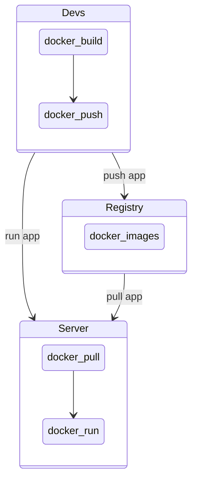
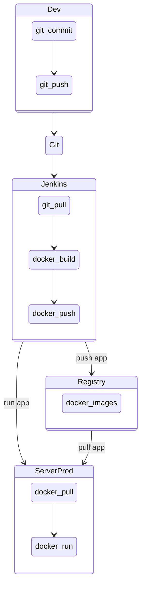

# Dockerize your live

<!-- vim-markdown-toc GFM -->

* [What is docker?](#what-is-docker)
  * [Difference between VM and Container](#difference-between-vm-and-container)
  * [Docker architecture.](#docker-architecture)
  * [Docker live cycle](#docker-live-cycle)
  * [Empathy](#empathy)
  * [Cmds](#cmds)
* [Check installation](#check-installation)
  * [Docker build](#docker-build)
    * [Docker file](#docker-file)
  * [Docker images](#docker-images)
  * [Docker run](#docker-run)
  * [Docker tag](#docker-tag)
  * [Docker ps](#docker-ps)
  * [Docker inspect](#docker-inspect)
* [Next Steps](#next-steps)

<!-- vim-markdown-toc -->
## What is docker?

- Open source project
- allows a easy way to **package**, **run** and **share** your app in a isolated environment (container)

### Difference between VM and Container


- Benefits: 
  - Flexible: Even the most complex applications can be containerized.
  - Lightweight: Containers leverage and share the host kernel, making them much more efficient in terms of system resources than virtual machines.
  - Portable: You can build locally, deploy to the cloud, and run anywhere.
  - Loosely coupled: Containers are highly self sufficient and encapsulated, allowing you to replace or upgrade one without disrupting others.
  - Scalable: You can increase and automatically distribute container replicas across a datacenter.
  - Secure: Containers apply aggressive constraints and isolations to processes without any configuration required on the part of the user.

### Docker architecture.


### Docker live cycle



### Empathy




### Cmds

## Check installation

```sh 
# 
docker --version
Docker version 19.03.8, build afacb8b

```

### Docker build 


#### Docker file


### Docker images

### Docker run

### Docker tag

### Docker ps

### Docker inspect

## Next Steps

